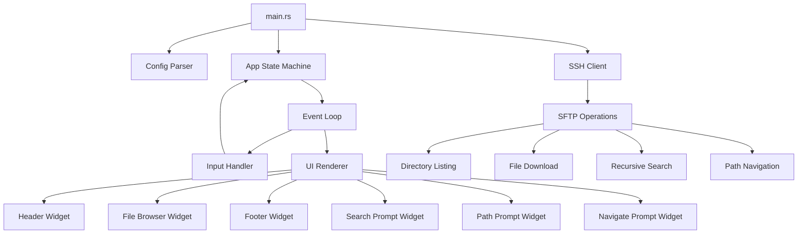
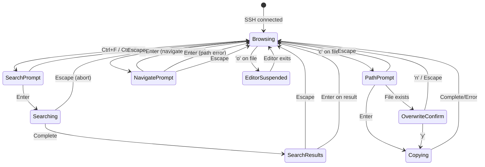
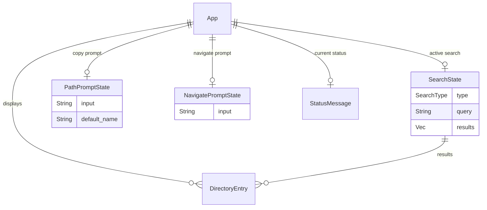

# Design Document: SSH Remote File Browser

## Overview

This document describes the technical design for a Rust TUI application that enables users to browse remote server file systems over SSH. The application uses `ratatui` for terminal rendering, `ssh2` (libssh2 bindings) for SSH/SFTP operations, and `crossterm` as the terminal backend. It reads connection configuration from a local file and provides an interactive file browser with navigation, file viewing, file copying, and search capabilities.

The architecture follows an event-driven loop pattern common in ratatui applications: read input → update state → render UI. SSH operations are performed synchronously on the main thread with timeout handling, keeping the implementation straightforward while still providing responsive feedback.

## Architecture



### High-Level Flow

1. **Startup**: Parse config → Establish SSH session → Open SFTP channel → List home directory
2. **Event Loop**: Poll for keyboard events → Dispatch to handler → Update app state → Render frame
3. **Operations**: All SFTP operations (list, read, stat) execute synchronously with configurable timeouts
4. **Shutdown**: Close SFTP → Close SSH session → Restore terminal → Exit

### State Machine



## Components and Interfaces

### Module Structure

```
src/
├── main.rs              # Entry point, arg parsing, orchestration
├── config.rs            # Config file parsing
├── ssh.rs               # SSH session and SFTP wrapper
├── app.rs               # Application state and state machine
├── event.rs             # Keyboard event handling / dispatch
├── ui/
│   ├── mod.rs           # Top-level render function
│   ├── header.rs        # Header bar widget
│   ├── browser.rs       # File browser list widget
│   ├── footer.rs        # Footer bar / status widget
│   ├── search_prompt.rs # Search input widget
│   ├── path_prompt.rs   # Copy path input widget
│   └── navigate_prompt.rs # Direct path navigation input widget
├── operations/
│   ├── mod.rs           # Operation trait and types
│   ├── listing.rs       # Directory listing logic
│   ├── download.rs      # File download (view + copy)
│   ├── search.rs        # Local and global find
│   └── navigate.rs      # Direct path navigation logic
└── types.rs             # Shared types (DirectoryEntry, etc.)
```

### Component Interfaces

#### `config.rs` — Config Parser

```rust
pub struct AppConfig {
    pub ssh_identity_file: PathBuf,
    pub username: String,
    pub ip_address: String,
}

impl AppConfig {
    /// Parse config from the given path. Returns detailed error on failure.
    pub fn from_file(path: &Path) -> Result<Self, ConfigError>;
}

pub enum ConfigError {
    FileNotFound(PathBuf),
    ReadError(PathBuf, io::Error),
    MissingField(&'static str),
    ParseError(String),
}
```

#### `ssh.rs` — SSH Client

```rust
pub struct SshClient {
    session: ssh2::Session,
    sftp: ssh2::Sftp,
}

impl SshClient {
    /// Connect using config. Timeout: 30 seconds.
    pub fn connect(config: &AppConfig) -> Result<Self, SshError>;

    /// List directory entries at the given remote path.
    pub fn list_dir(&self, path: &Path) -> Result<Vec<DirectoryEntry>, SshError>;

    /// Read file contents into a local writer. Returns bytes written.
    pub fn download_file(&self, remote_path: &Path, writer: &mut impl Write) -> Result<u64, SshError>;

    /// Get file metadata (size, type).
    pub fn stat(&self, path: &Path) -> Result<FileStat, SshError>;

    /// Execute a find command remotely for global search.
    pub fn find_recursive(&self, base: &Path, pattern: &str) -> Result<Vec<DirectoryEntry>, SshError>;

    /// Check if connection is alive.
    pub fn is_connected(&self) -> bool;
}

pub enum SshError {
    ConnectionFailed(String),
    AuthenticationFailed(String),
    Timeout,
    PermissionDenied(PathBuf),
    ConnectionLost,
    IoError(io::Error),
}
```

#### `app.rs` — Application State

```rust
pub struct App {
    pub mode: AppMode,
    pub current_path: PathBuf,
    pub entries: Vec<DirectoryEntry>,
    pub selected_index: usize,
    pub show_hidden: bool,
    pub status_message: Option<StatusMessage>,
    pub search_state: Option<SearchState>,
    pub path_prompt_state: Option<PathPromptState>,
    pub navigate_prompt_state: Option<NavigatePromptState>,
    pub loading: bool,
}

pub enum AppMode {
    Browsing,
    SearchPrompt { search_type: SearchType },
    Searching { search_type: SearchType, progress: usize },
    SearchResults,
    PathPrompt,
    OverwriteConfirm { path: PathBuf },
    Copying { bytes_transferred: u64 },
    NavigatePrompt,
}

pub enum SearchType {
    Local,
    Global,
}

impl App {
    pub fn new(initial_path: PathBuf, entries: Vec<DirectoryEntry>) -> Self;
    pub fn move_cursor_down(&mut self);
    pub fn move_cursor_up(&mut self);
    pub fn selected_entry(&self) -> Option<&DirectoryEntry>;
    pub fn set_status(&mut self, message: StatusMessage);
    pub fn clear_expired_status(&mut self);
    /// Set the cursor to the entry matching the given filename, or 0 if not found.
    pub fn select_entry_by_name(&mut self, name: &str);
}
```

#### `types.rs` — Shared Types

```rust
pub struct DirectoryEntry {
    pub name: String,
    pub path: PathBuf,
    pub entry_type: EntryType,
    pub size: u64,
}

pub enum EntryType {
    File,
    Directory,
    Symlink,
}

pub struct StatusMessage {
    pub text: String,
    pub level: StatusLevel,
    pub created_at: Instant,
}

pub enum StatusLevel {
    Info,
    Success,
    Error,
}

/// Format bytes into human-readable string (B, KB, MB, GB)
pub fn format_size(bytes: u64) -> String;

/// Truncate a name to max_len characters, appending ellipsis if truncated
pub fn truncate_name(name: &str, max_len: usize) -> String;
```

#### `operations/listing.rs` — Directory Listing

```rust
/// List and sort directory entries. Filters hidden if show_hidden is false.
pub fn list_directory(
    ssh: &SshClient,
    path: &Path,
    show_hidden: bool,
) -> Result<Vec<DirectoryEntry>, SshError>;

/// Sort entries: directories first, then alphabetical case-insensitive within each group.
pub fn sort_entries(entries: &mut Vec<DirectoryEntry>);
```

#### `operations/search.rs` — Search Operations

```rust
/// Search within a single directory (non-recursive, case-insensitive substring match).
pub fn local_find(
    ssh: &SshClient,
    dir: &Path,
    query: &str,
    show_hidden: bool,
) -> Result<Vec<DirectoryEntry>, SshError>;

/// Recursive search from base directory downward. Returns matching entries with relative paths.
/// Accepts a callback for progress reporting and abort checking.
pub fn global_find(
    ssh: &SshClient,
    base: &Path,
    query: &str,
    show_hidden: bool,
    on_progress: impl FnMut(usize) -> bool,  // returns false to abort
) -> Result<Vec<DirectoryEntry>, SshError>;
```

#### `operations/navigate.rs` — Direct Path Navigation

```rust
/// Result of resolving a navigation target path via stat.
pub enum NavigateTarget {
    Directory(PathBuf),
    File { parent: PathBuf, filename: String },
}

/// Validate that the input is an absolute path (starts with '/').
pub fn validate_absolute_path(input: &str) -> bool;

/// Resolve a navigation target: stat the path to determine if it's a file or directory.
/// Returns NavigateTarget indicating where to navigate and how to set the cursor.
pub fn resolve_navigate_target(
    ssh: &SshClient,
    path: &Path,
) -> Result<NavigateTarget, SshError>;
```

## Data Models

### Config File Format

The config file uses a simple `key=value` format, one field per line:

```
ssh_identity_file=/home/user/.ssh/id_rsa
username=deploy
ip_address=192.168.1.100
```

- Lines starting with `#` are comments and ignored.
- Whitespace around keys and values is trimmed.
- All three fields are required.

### DirectoryEntry

| Field       | Type       | Description                                    |
|-------------|------------|------------------------------------------------|
| `name`      | `String`   | File/directory base name                       |
| `path`      | `PathBuf`  | Absolute remote path                           |
| `entry_type`| `EntryType`| File, Directory, or Symlink                    |
| `size`      | `u64`      | Size in bytes (0 for directories)              |

### Application State Relationships




## Correctness Properties

*A property is a characteristic or behavior that should hold true across all valid executions of a system — essentially, a formal statement about what the system should do. Properties serve as the bridge between human-readable specifications and machine-verifiable correctness guarantees.*

### Property 1: Config parsing round trip

*For any* valid config content containing `ssh_identity_file`, `username`, and `ip_address` fields (with arbitrary non-empty values and optional whitespace/comments), parsing the content should succeed and the returned `AppConfig` should contain exactly the values specified for each field.

**Validates: Requirements 1.3**

### Property 2: Config missing field detection

*For any* config content that is missing at least one of the three required fields (`ssh_identity_file`, `username`, `ip_address`), parsing should return a `ConfigError::MissingField` error that identifies a field that is actually absent from the content.

**Validates: Requirements 1.6**

### Property 3: Entry display formatting

*For any* string `name`, `truncate_name(name, 60)` should return a string of at most 63 characters (60 + "..." suffix), where if `name.len() > 60` the result ends with "..." and the first 60 characters match the original, and if `name.len() <= 60` the result equals the original. Additionally, *for any* `u64` value, `format_size` should return a non-empty string matching the pattern `<number> <unit>` where unit is one of B, KB, MB, or GB.

**Validates: Requirements 2.2**

### Property 4: Entry sorting invariant

*For any* list of `DirectoryEntry` items, after applying `sort_entries`, all directory-type entries should appear before all file-type entries, and within each group (directories, files), entries should be ordered by case-insensitive alphabetical comparison of their names.

**Validates: Requirements 2.3**

### Property 5: Cursor movement bounds

*For any* list of length N > 0 and any valid cursor position `i` in [0, N-1]: moving down when `i < N-1` should yield position `i+1`, moving down when `i == N-1` should yield `N-1`, moving up when `i > 0` should yield `i-1`, and moving up when `i == 0` should yield `0`. The cursor should never be outside [0, N-1].

**Validates: Requirements 3.1, 3.2, 3.3, 3.4**

### Property 6: Parent path navigation

*For any* absolute path that is not the root (`/`), computing the parent should yield the path with the last component removed. For the root path, computing the parent should yield the root itself.

**Validates: Requirements 3.7, 3.8**

### Property 7: Relative path resolution

*For any* valid relative path (non-empty, no null bytes) and any valid working directory, resolving the relative path against the working directory should yield a path that starts with the working directory and ends with the relative path components.

**Validates: Requirements 5.3**

### Property 8: Status message visibility

*For any* `StatusMessage` and any elapsed duration, the message should be considered visible (not clearable) if the elapsed time since creation is less than 3 seconds, and should be considered clearable if the elapsed time is >= 3 seconds.

**Validates: Requirements 6.2**

### Property 9: Case-insensitive substring matching

*For any* entry name and any query string, the search matching predicate should return `true` if and only if the lowercased name contains the lowercased query as a substring. This applies uniformly to both Local_Find and Global_Find operations.

**Validates: Requirements 7.4, 7.5**

### Property 10: Search result display completeness

*For any* `DirectoryEntry` with a base path, the formatted search result string should contain the entry's relative path from the base, a valid formatted size string, and a type indicator character corresponding to the entry's type (file, directory, or symlink).

**Validates: Requirements 7.6**

### Property 11: Absolute path validation

*For any* non-empty string, `validate_absolute_path` should return `true` if and only if the string starts with the character `/`. Strings that are empty or start with any other character should return `false`.

**Validates: Requirements 8.2**

### Property 12: Navigate cursor placement on file target

*For any* list of `DirectoryEntry` items containing an entry with a given filename, calling `select_entry_by_name` with that filename should set the cursor to the index of that entry in the list. If the filename is not present in the list, the cursor should be set to 0.

**Validates: Requirements 8.5**

## Error Handling

### Error Categories

| Category | Source | Handling |
|----------|--------|----------|
| Config errors | File I/O, parsing | Print to stderr, exit with code 1 |
| Connection errors | SSH handshake, auth | Print to stderr, exit with code 1 |
| Runtime SSH errors | SFTP operations timeout/fail | Display in TUI status bar, remain on current state |
| Connection lost | Network drop during operation | Restore terminal, print to stderr, exit with code 1 |
| File operation errors | Permission denied, size limit | Display in TUI status bar, cancel operation |
| Local I/O errors | Write failure, missing parent dir | Display in TUI status bar/prompt, cancel operation |

### Error Flow

1. **Pre-TUI errors** (config, initial connection): Print message to stderr and exit immediately with non-zero status. These happen before the alternate screen is entered.

2. **In-TUI recoverable errors** (permission denied, timeout, download failure): Display error in the status bar for minimum 3 seconds. The application remains functional and the user can continue browsing.

3. **In-TUI fatal errors** (connection lost): Cleanly exit alternate screen mode, restore terminal state, print connection-lost message to stderr, and exit with non-zero status.

4. **Partial operation cleanup**: Any operation that creates temporary or partial files (file view temp file, partial copy) must delete those files on error before displaying the error message.

### Terminal State Safety

The application uses a `Drop` guard or explicit cleanup in all exit paths to ensure:
- Alternate screen is exited
- Raw mode is disabled
- Cursor is made visible
- Terminal attributes are restored

This is critical for connection-lost scenarios where panicking or early-return could leave the terminal in a broken state. Using `std::panic::set_hook` to restore terminal state on panic is recommended.

## Testing Strategy

### Unit Tests

Unit tests cover pure logic functions and state transitions:

- **Config parsing**: Valid configs, missing fields, malformed content, comments, whitespace handling
- **Entry sorting**: Various combinations of files/directories, case sensitivity
- **Name truncation**: Boundary at 60 characters, Unicode handling
- **Size formatting**: Boundary values (0, 1023, 1024, 1MB, 1GB, u64::MAX)
- **Cursor movement**: All boundary conditions
- **Path resolution**: Relative paths, current-dir paths
- **Status message expiry**: Time-based visibility
- **Search matching**: Various query/name combinations, empty strings, Unicode
- **State transitions**: Mode changes for each key binding (including 'm' → NavigatePrompt)
- **Navigate path validation**: Absolute vs relative paths, empty input
- **Navigate target resolution**: Directory target, file target (parent + cursor placement), nonexistent path error

### Property-Based Tests

Property-based tests use the `proptest` crate (Rust's standard PBT library) with minimum 100 iterations per property:

| Property | Generator Strategy |
|----------|-------------------|
| Config round trip | Arbitrary non-empty strings for field values, random whitespace/comments |
| Missing field detection | Config with 1-3 fields randomly removed |
| Display formatting | Arbitrary strings (0-200 chars), arbitrary u64 |
| Sorting invariant | Vec of 0-100 random DirectoryEntry items with random types/names |
| Cursor bounds | List lengths 1-1000, random starting positions |
| Parent navigation | Random absolute paths with 0-20 components |
| Path resolution | Random relative paths, random working directories |
| Status visibility | Random Instant offsets from 0ms to 10s |
| Substring matching | Random name strings, random query strings (including empty) |
| Search result display | Random DirectoryEntry with random base paths |
| Absolute path validation | Random strings including empty, with/without leading '/' |
| Navigate cursor placement | Vec of 1-100 random DirectoryEntry items, random target filename (present or absent) |

Each test is tagged: `// Feature: ssh-remote-file-browser, Property N: <title>`

Configuration:
```rust
proptest! {
    #![proptest_config(ProptestConfig::with_cases(100))]
    // ...
}
```

### Integration Tests

Integration tests require a test SSH server (or Docker container with sshd):

- **Connection establishment**: Valid credentials, invalid key, wrong host, timeout
- **Directory listing**: Real SFTP readdir with known directory structure
- **File download**: Complete and interrupted transfers
- **Recursive search**: Known file tree with predictable matches
- **Connection loss**: Simulate network drop during operation
- **Direct path navigation**: Navigate to known directory, navigate to known file (verify parent listing + cursor), navigate to nonexistent path (verify error)

### Manual Testing Checklist

- Terminal state restored correctly after quit, connection loss, and panic
- Editor suspension and resume works with vim, less, nano
- Large directories (1000+ entries) render without lag
- Unicode filenames display correctly
- Symlinks display with correct type indicator
