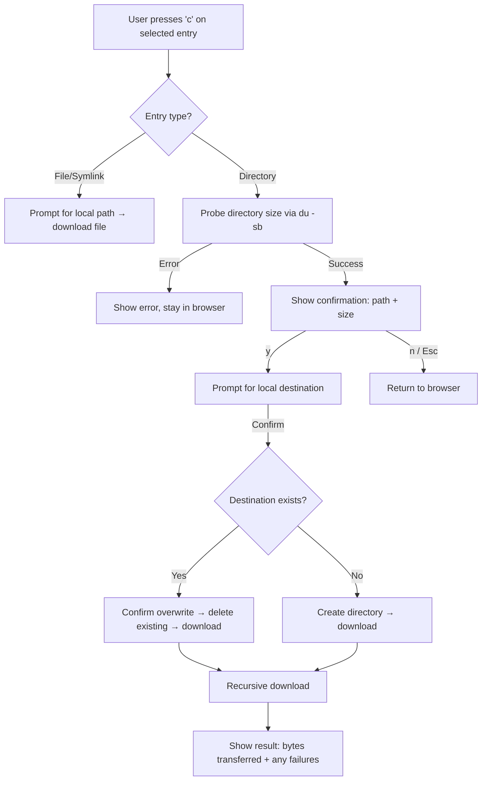
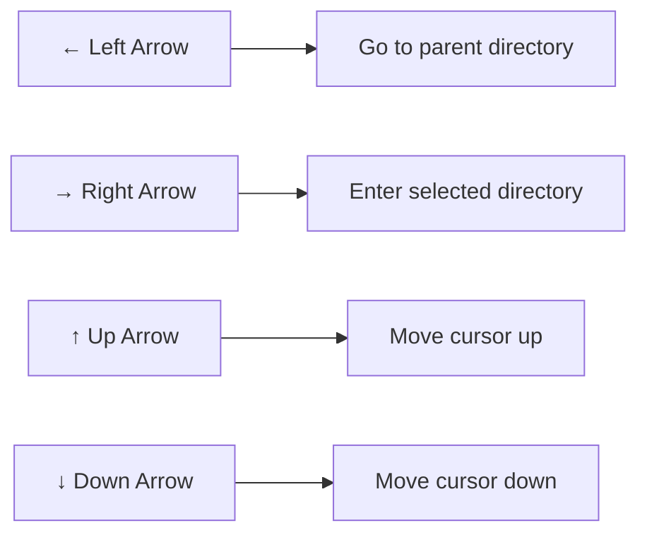
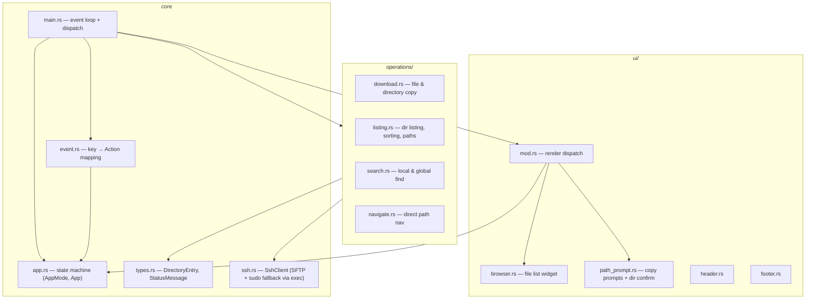
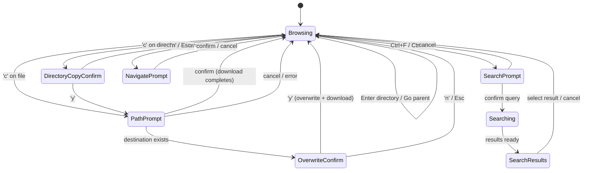
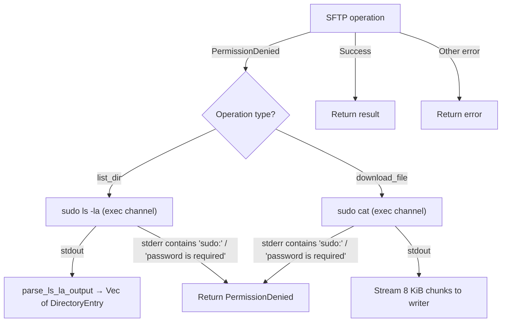

# Arrow Navigation & Directory Download — Design Overview

## User Flow: Directory Download

## User Flow: Arrow Navigation

Left/Right are alternative bindings for Backspace and Enter respectively.

## Module Architecture

## State Machine (AppMode)

## Sudo Fallback for Privileged Directories

When SFTP operations fail with `PermissionDenied`, the SSH client transparently escalates to `sudo` via exec channels:

Key implementation details:

- **`sudo_ls_la`** — Runs `LC_ALL=C sudo ls -la <path>` over an exec channel. Output is parsed field-by-field (permissions → type, field 4 → size, fields 8+ → filename). Symlink targets (` -> ...`) are stripped from names. `.` and `..` are excluded.
- **`sudo_cat`** — Runs `sudo cat <path>` over an exec channel. Streams stdout to the caller's writer in 8 KiB chunks and returns total bytes written.
- **Error logging** — On `PermissionDenied` (before fallback), a timestamped line is appended to `rfv-errors.log` in the working directory. Logging is best-effort and failures are silently ignored.
- **Passwordless sudo required** — If stderr indicates a password prompt, the fallback returns `PermissionDenied` rather than hanging. The feature assumes NOPASSWD sudo is configured on the remote host.

## Key Design Decisions

- **No progress mode**: The recursive download blocks the event loop. The UI freezes during download. This matches the existing behavior for all SSH operations (file copy, search, listing).
- **Entry-type branching at dispatch time**: The PathPrompt and OverwriteConfirm handlers check `app.selected_entry().entry_type` to decide file vs directory copy logic — no extra state needed.
- **Reused actions**: `DirectoryCopyConfirm` uses existing `ConfirmOverwrite`/`DenyOverwrite` actions. The dispatcher differentiates by checking the current `AppMode`.
- **Best-effort downloads**: Individual file failures are recorded and skipped. The user sees a summary at the end.
- **Transparent escalation**: Sudo fallback is invisible to callers of `list_dir` and `download_file` — the same `Result` types are returned regardless of which path was taken.
